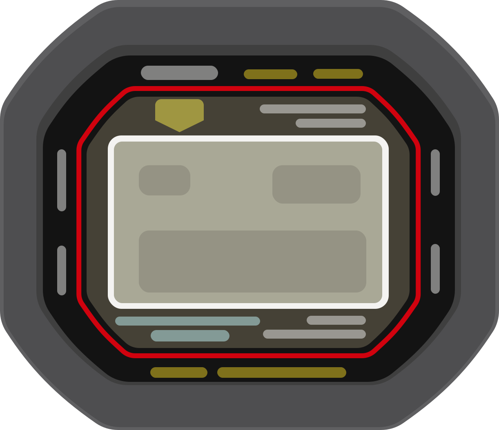

# Skuare

An alternative app that connects G-Shock watches via BLE.

## Background

In October 2024, a significant [data breach](https://world.casio.com/news/2025/0107-incident) occurred,
compromising the personal information of thousands of individuals, including employees, business partners, and customers.
This incident raised concerns about how user data is handled, especially considering that the official app stores
geolocation data online. 

As a long-time enthusiast of Casio watches and a proponent of user privacy, I was motivated to develop Skuare—a simple,
basic app with full support for the G-Shock Bluetooth protocol.
Skuare enables users to connect to their Casio watches with trust,
operating entirely offline to ensure that no personal data is transmitted over the internet.

The underlying protocol was reverse-engineered from the official Casio app, with significant assistance from
[GShockAPI](https://github.com/izivkov/GShockAPI/tree/main).

## Compatibility

Skuare is currently supported and has been tested on the following Casio modules:

- [Module 3539](https://shockbase.org/watches/modules_dyn.php?module=3539)
- [Module 3540](https://shockbase.org/watches/modules_dyn.php?module=3540)
- [Module 3461](https://shockbase.org/watches/modules_dyn.php?module=3461) (not tested)
- [Module 3459](https://shockbase.org/watches/modules_dyn.php?module=3459) (not tested)

## Why rebuild everything when [GShockAPI](https://github.com/izivkov/GShockAPI/tree/main) already exists?

[GShockAPI](https://github.com/izivkov/GShockAPI/tree/main) offers broader support for multiple Casio watch models.
However, I wanted a structure tailored more closely to my own preferences and found rebuilding from scratch to be an
excellent opportunity to deepen my understanding of Kotlin, JetBrains Compose Multiplatform, and core BLE communication concepts.

## Supported watch features

- [x] Watch settings
  - [x] Watch name
  - [ ] Battery level 
  - [x] BLE connection timeout
  - [x] Time adjustment settings
  - [x] Date time display preference
  - [x] Power saving mode
  - [x] Backlight duration
  - [x] Auto backlight
- [x] Time adjustment procedure
- [x] Home timezone and world timezone
  - [x] Timezone names, info and DST settings
    - Currently ignores outputs from the watch, it always use values from timezones lookup tables.
  - [x] Timezone gps coordinates and radio signal ID
    - For home time timezones, it tries to get coordinates from the equivalent world timezone.  
- [x] Alarms
  - [x] Hourly Signal
- [x] Timer
- [x] Reminders title and config

## Roadmap

- [x] Map out the data models
- [X] Implement BLE communication protocol
- [ ] Simple UI to pair and interact with the watch
- [ ] Local sqlite or shared preference to keep track of paired watches
- [ ] Support auto time adjustment procedure when app is not in foreground
  - [ ] Android companion device manager
  - [ ] iOS bluetooth central
- [ ] Figure out unknown packets

## To be fixed

- [ ] Handle multiple peripheral found when scanning for watches
- [ ] Default data when invalid data received from watch, including timezone

## Disclaimer

This project is an independent, open-source implementation for communicating with Casio watches over Bluetooth.
It is not affiliated with, endorsed by, or sponsored by Casio Computer Co., Ltd.
All brand names and trademarks are the property of their respective owners.

The Bluetooth communication protocol and data formats used by Casio watches were independently reverse-engineered
through behavioral observation and traffic analysis. No proprietary source code or copyrighted assets 
from Casio or its applications are included in this project.
